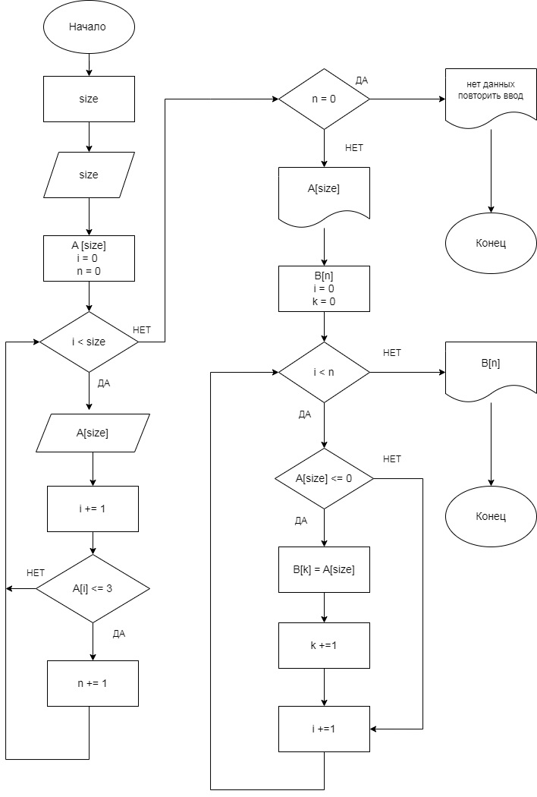

# Итоговая проверочная работа

## __ЗАДАНИЕ:__
      Написать программу, которая из имеющегося массива строк формирует массив из строк, длина которых меньше либо равна 3 символа. Первоначальный массив можно ввести с клавиатуры, либо задать на старте выполнения алгоритма. При решение не рекомендуется пользоваться коллекциями, лучше обойтись исключительно массивами.

### _Состав задания:_
1. Создать репозиторий на GitHub
2. Нарисовать блок-схему алгоритма (алгоритм реализован для случая линейного программирования).
3. Снабдить репозиторий оформленным текстовым описанием решения (файл README.md)
4. Написать программу, решающую поставленную задачу
5. Использовать контроль версий в работе над этим небольшим проектом (не должно быть так, что все залито одним коммитом, как минимум этапы 2, 3 и 4 должны быть расположены в разных коммитах)  

## __Этап 1.__ Создать репозиторий на GitHub.
Ссылка на репозиторий 

## __Этап 2.__ Блок схема алгорима.
_Блок-схма реализована для линейного варианта программирования._ 
- В папке находится файл с изображением блок-схемы для случая линейного ().   

## __Этап 3.__ Описание алгоритма решения задачи
- Пользователь указывает размерность массива (N) который он хочет задать.
- Проводится проверка что вводимый знак это число и если "ДА", то программа выполлняется далее. Если нет, то программа прерывается и выводится текстовая строка "Ошибочный ввод! Не цифра! ПереВВедите!".
- Далее пользователь заполняет стартовый массив элементами в цикле N-раз. Массив выводится на печать. 
- Далее определяем размерность итогового массива проходя по стартовому массиву в цикле и проверяем, подходит ли элемент условию "длина элемента массива <= 3". Если элемент подходит под данное условие, то мы использем счетчик "К", увеличивая значения при каждом соотвествии.  
- Проводим проверку на наличие элементов первичного массива соответствующим требованиям задачи и если они есть то программа выполняется далее. Если нет, то программа прерывается и выводится текстовая строка "Строк нужной размерности не найдено. Повторите процедуру!".  
- Далее создаем итоговый массив размера "К". Проходим по начальному массиву и найдя элемент удовлетворяющим требованимя и заполняем итоговый массив.
Итоговый массив выводится на печать.

## __Этап 4.__ Решение задачи на C#
В папке решение задачи на C# с использованием методов. 
Есть варитант с линейный (тривиальным) типом программирования. Для такоего вариант составлена блок-схема. 

